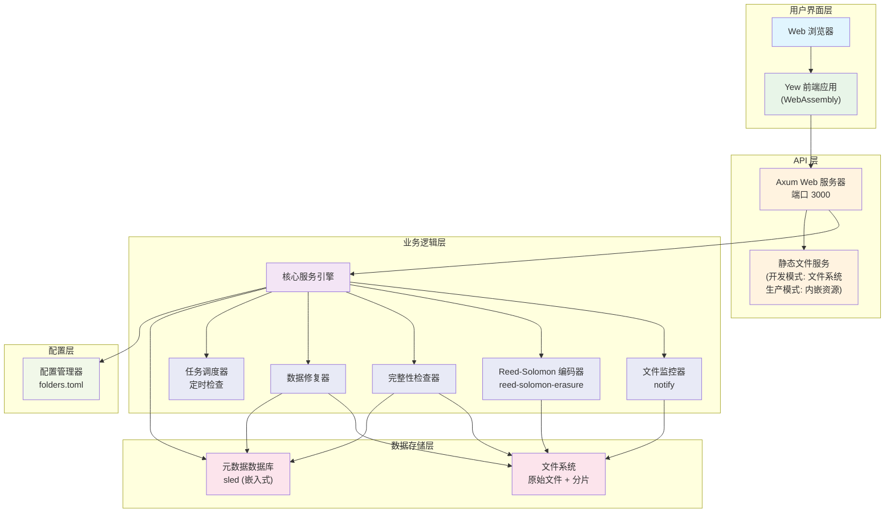
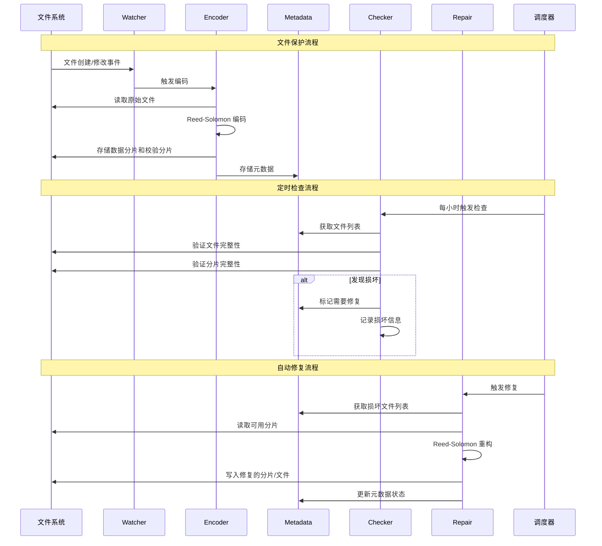
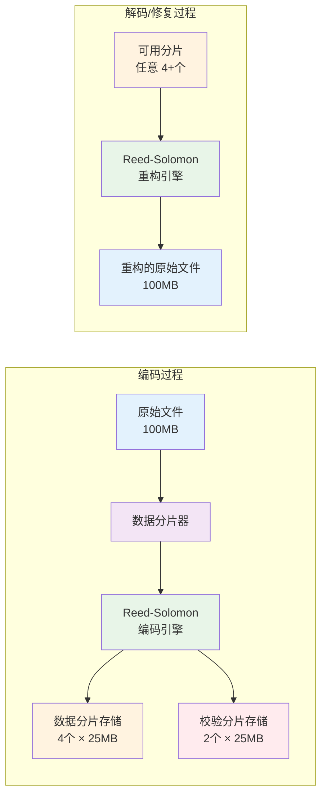
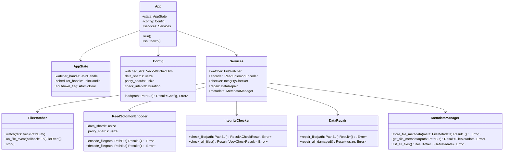

# rs_guard 🛡️

[](https://github.com/ModerRAS/rs_guard/actions/workflows/ci.yml)
[](https://www.gnu.org/licenses/gpl-3.0)
[](./docs/README_en.md)

一个使用 Rust 构建的现代化数据保护服务，为您重要的目录提供持续的、块级别的冗余备份与完整性校验。

`rs_guard` 会监视您指定的文件，使用里德-所罗门码（Reed-Solomon）对其进行编码，并定期校验其数据完整性。当检测到数据损坏时，它会自动从冗余数据中恢复。所有这一切，都通过一个简洁、实时的 Web 界面进行管理。

 
*(注: 当 UI 开发更完善后，此处应替换为真实的界面截图)*

---

## ✨ 功能特性

-   **块级冗余备份**: 将文件分割成数据块，并使用里德-所罗门码生成校验块（可配置 `N+M` 冗余度）。
-   **持续完整性校验**: 在后台定时执行任务，周期性地验证原始文件和校验块的完整性。
-   **自动修复**: 如果某个数据块或校验块丢失、损坏，`rs_guard` 能够利用剩余的块自动重建它。
-   **实时文件监控**: 使用 `notify` 库监控文件系统，自动保护新增文件、更新被修改的文件。
-   **Web 管理界面**: 一个使用 Rust (Yew + Wasm) 构建的现代化、实时的仪表盘，用于监控服务状态、查看日志，并手动触发操作。
-   **单文件部署**: 在生产环境下，整个前端界面会被内嵌到后端二进制文件中，使部署过程简化到极致——只需拷贝一个文件。
-   **跨平台**: 设计为可以在 Windows 和 Linux 上作为长期运行的服务。

## 🛠️ 技术栈

| 领域     | 技术与工具                                                                                                 |
| :------- | :--------------------------------------------------------------------------------------------------------- |
| **后端** | [**`axum`**](https://crates.io/crates/axum) (Web 服务), [**`tokio`**](https://crates.io/crates/tokio) (异步运行时), [**`reed-solomon-erasure`**](https://crates.io/crates/reed-solomon-erasure) (纠删码), [**`notify`**](https://crates.io/crates/notify) (文件监控), [**`sled`**](https://crates.io/crates/sled) (元数据存储), [**`rust-embed`**](https://crates.io/crates/rust-embed) (内嵌前端资源)。 |
| **前端** | [**`yew`**](https://crates.io/crates/yew) (Wasm 响应式框架), [**`trunk`**](https://trunkrs.dev/) (构建与资源管理), [**`reqwasm`**](https://crates.io/crates/reqwasm) (API 请求)。 |
| **共享**   | [**`serde`**](https://crates.io/crates/serde) (用于在前后端之间进行可靠的序列化与反序列化)。                    |

如果希望深入了解项目结构，请查阅 [**架构概览**](./docs/architecture.md)。

## 🏗️ 系统架构

### 整体架构图



### 数据流程图



### Reed-Solomon 编码架构



### 组件交互详细图



## 🚀 快速上手

### 环境准备

1.  **安装 Rust**: 如果您尚未安装，请访问 [rustup.rs](https://rustup.rs/) 获取。
2.  **添加 Wasm 编译目标**: 前端需要编译到 WebAssembly。请通过此命令添加：
    ```bash
    rustup target add wasm32-unknown-unknown
    ```
3.  **安装 Trunk**: Trunk 是我们用于构建 Wasm 前端的工具。
    ```bash
    cargo install trunk
    ```

### 开发模式运行

为了获得最佳的开发体验（包含热重载），请在不同的终端中分别运行后端和前端。

1.  **运行后端服务**:
    ```bash
    # 此命令会监控文件变化，并在 http://127.0.0.1:3000 提供 API 服务
    cargo run -p backend
    ```
    *注意: 首次运行时，如果 `./test-data/source` 目录不存在，程序会报错退出。这是预期的行为，在您手动创建该目录后即可正常运行。*

2.  **运行前端服务**:
    ```bash
    # 此命令会在 http://127.0.0.1:8080 启动前端开发服务器，并自动代理 API 请求
    cd frontend
    trunk serve
    ```
    Trunk 会自动在您的浏览器中打开一个新标签页。您对前端代码的任何修改都会被自动编译并实时刷新到浏览器中。

## 📦 构建生产版本

要创建一个用于部署的、独立的二进制文件：

1.  **构建前端静态资源**:
    ```bash
    cd frontend
    trunk build --release
    ```
    此命令会在 `frontend/dist` 目录中生成优化后的静态文件。

2.  **构建内嵌前端的后端**:
    ```bash
    # 此命令会构建一个经过发布优化的二进制文件，并包含所有前端资源
    cargo build -p backend --release
    ```
    最终的可执行文件位于 `target/release/backend` (在 Windows 上是 `backend.exe`)。您只需将这一个文件拷贝到您的服务器上即可完成部署。

## 🤝 参与贡献

欢迎任何形式的贡献！无论是 Bug 报告、功能建议还是代码提交 (Pull Request)，都请随时参与。

1.  Fork 本仓库。
2.  创建您的功能分支 (`git checkout -b feature/AmazingFeature`)。
3.  提交您的修改 (`git commit -m 'Add some AmazingFeature'`)。
4.  将分支推送到远程 (`git push origin feature/AmazingFeature`)。
5.  创建一个 Pull Request。

## 📜 开源许可

本项目基于 **GNU General Public License v3.0** 许可。详情请参阅 [LICENSE](./LICENSE) 文件。 