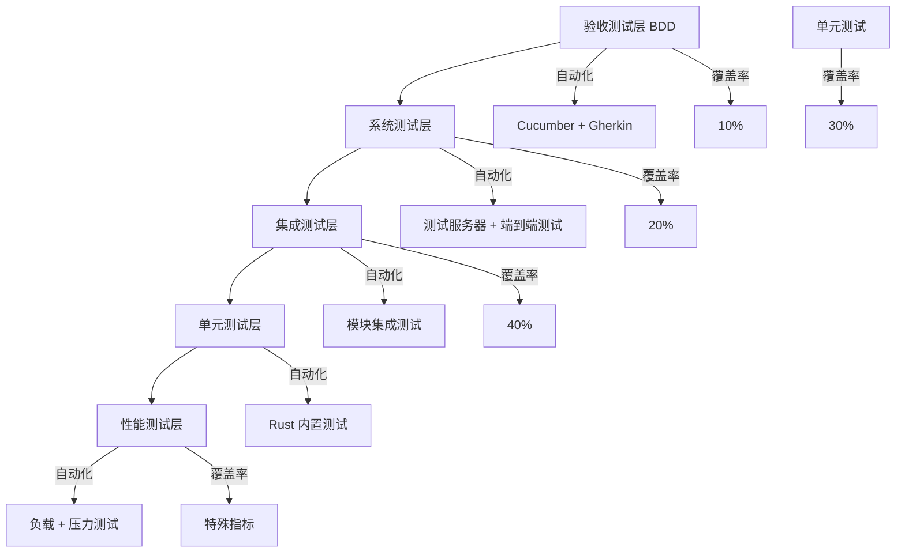
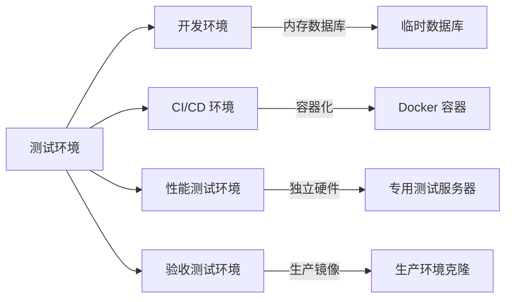
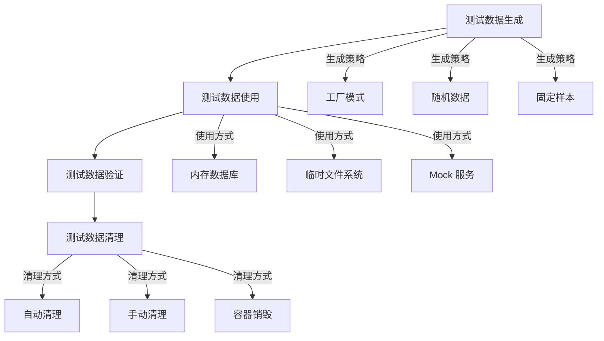
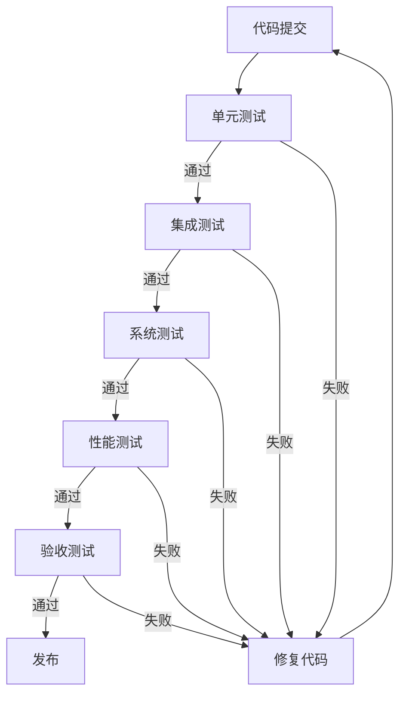

# rs_guard 测试架构设计

## 概述

本文档定义了 rs_guard 项目的完整测试架构，采用分层测试策略，确保系统的质量、可靠性和性能。测试架构基于测试金字塔模型，结合 BDD（行为驱动开发）方法论。

## 测试架构总览

### 测试金字塔模型



### 测试环境隔离策略



## 测试分层设计

### 1. 单元测试层 (Unit Tests)

**目标**: 测试最小可测试单元（函数、方法、结构体）
**工具**: Rust 内置测试框架
**覆盖率**: 30%+
**执行频率**: 每次代码提交

#### 测试结构
```
backend/src/
├── encoder.rs
│   └── #[cfg(test)] tests.rs
├── checker.rs
│   └── #[cfg(test)] tests.rs
├── repair.rs
│   └── #[cfg(test)] tests.rs
├── watcher.rs
│   └── #[cfg(test)] tests.rs
├── metadata.rs
│   └── #[cfg(test)] tests.rs
└── lib.rs
    └── #[cfg(test)] tests.rs
```

#### 测试示例
```rust
#[cfg(test)]
mod tests {
    use super::*;
    use tempfile::TempDir;
    
    #[test]
    fn test_reed_solomon_encoding() {
        // 简化实现：仅测试基本编码功能
        let data = b"test data";
        let encoded = encode_data(data).unwrap();
        assert!(!encoded.is_empty());
    }
    
    #[test]
    fn test_reed_solomon_decoding() {
        // 简化实现：仅测试基本解码功能
        let data = b"test data";
        let encoded = encode_data(data).unwrap();
        let decoded = decode_data(&encoded).unwrap();
        assert_eq!(data, decoded.as_slice());
    }
}
```

### 2. 集成测试层 (Integration Tests)

**目标**: 测试模块间的交互和接口
**工具**: Rust 集成测试 + tokio-test
**覆盖率**: 40%+
**执行频率**: 每次构建

#### 测试结构
```
backend/tests/
├── common/                  # 测试公共模块
│   ├── mod.rs              # 测试工具函数
│   ├── test_helpers.rs     # 测试助手函数
│   └── fixtures.rs         # 测试数据
├── api_integration.rs      # API 集成测试
├── database_integration.rs # 数据库集成测试
├── file_system_integration.rs # 文件系统集成测试
└── workflow_integration.rs # 工作流集成测试
```

#### 测试示例
```rust
mod common;
use common::{setup_test_app, create_test_file, cleanup_test_files};

#[tokio::test]
async fn test_file_monitoring_integration() {
    // 简化实现：仅测试基本监控集成
    let temp_dir = TempDir::new().unwrap();
    let app = setup_test_app().await;
    
    // 创建测试文件
    let test_file = create_test_file(&temp_dir, "test.txt").await;
    
    // 等待监控检测
    tokio::time::sleep(tokio::time::Duration::from_secs(2)).await;
    
    // 验证文件被监控
    let status = get_app_status(&app).await;
    assert!(status.monitored_files > 0);
}
```

### 3. 系统测试层 (System Tests)

**目标**: 测试整个系统的端到端功能
**工具**: 自定义测试框架 + Docker
**覆盖率**: 20%+
**执行频率**: 每日构建

#### 测试结构
```
tests/system/
├── docker-compose.yml      # 测试环境配置
├── system_tests.rs         # 系统测试主文件
├── end_to_end_tests.rs     # 端到端测试
├── deployment_tests.rs    # 部署测试
└── recovery_tests.rs      # 恢复测试
```

#### 测试示例
```rust
#[tokio::test]
async fn test_system_end_to_end_workflow() {
    // 简化实现：仅测试基本端到端流程
    let system = TestSystem::new().await;
    
    // 启动系统
    system.start().await;
    
    // 创建测试文件
    system.create_test_files().await;
    
    // 等待处理完成
    system.wait_for_processing().await;
    
    // 验证结果
    assert!(system.verify_integrity().await);
    
    // 清理
    system.cleanup().await;
}
```

### 4. 验收测试层 (Acceptance Tests - BDD)

**目标**: 验证系统满足业务需求
**工具**: Cucumber + Gherkin
**覆盖率**: 10%+
**执行频率**: 发布前

#### 测试结构
```
tests/acceptance/
├── features/               # BDD 特性文件
│   ├── file_monitoring.feature
│   ├── data_encoding.feature
│   ├── integrity_checking.feature
│   ├── data_repair.feature
│   └── web_interface.feature
├── steps/                  # 步骤定义
│   ├── file_steps.rs
│   ├── encoding_steps.rs
│   ├── integrity_steps.rs
│   ├── repair_steps.rs
│   └── web_steps.rs
└── support/                # 支持文件
    ├── world.rs           # 共享状态
    └── hooks.rs           # 测试钩子
```

#### Gherkin 示例
```gherkin
Feature: 文件监控功能
  作为系统管理员
  我希望系统能够监控文件变化
  以便自动保护数据完整性

  Scenario: 文件创建监控
    Given 系统正在监控目录 "./test-data/source"
    When 在监控目录中创建文件 "test.txt"
    Then 系统应该在 2 秒内检测到文件创建
    And 记录文件创建事件
    And 开始处理该文件
```

### 5. 性能测试层 (Performance Tests)

**目标**: 验证系统性能指标
**工具**: Criterion + 自定义负载测试
**执行频率**: 每周 + 发布前

#### 测试结构
```
tests/performance/
├── benches/                # 性能基准测试
│   ├── encoding_benchmark.rs
│   ├── integrity_benchmark.rs
│   ├── repair_benchmark.rs
│   └── api_benchmark.rs
├── load/                   # 负载测试
│   ├── file_creation_load.rs
│   ├── concurrent_operations_load.rs
│   └── memory_usage_load.rs
└── stress/                 # 压力测试
    ├── high_volume_stress.rs
    └── long_running_stress.rs
```

## 测试数据管理

### 测试数据生命周期



### 测试数据工厂

```rust
// 测试数据工厂
pub struct TestDataFactory {
    temp_dir: TempDir,
}

impl TestDataFactory {
    pub fn new() -> Self {
        Self {
            temp_dir: TempDir::new().unwrap(),
        }
    }
    
    pub fn create_test_file(&self, name: &str, size: usize) -> PathBuf {
        let path = self.temp_dir.path().join(name);
        let data = vec![0u8; size];
        fs::write(&path, data).unwrap();
        path
    }
    
    pub fn create_config_file(&self, config: &Config) -> PathBuf {
        let path = self.temp_dir.path().join("config.toml");
        let content = toml::to_string_pretty(config).unwrap();
        fs::write(&path, content).unwrap();
        path
    }
}
```

## 模拟和桩对象

### 模拟策略

```rust
// 文件系统模拟
#[derive(Debug)]
pub struct MockFileSystem {
    files: HashMap<PathBuf, Vec<u8>>,
}

impl MockFileSystem {
    pub fn new() -> Self {
        Self {
            files: HashMap::new(),
        }
    }
    
    pub fn add_file(&mut self, path: &Path, data: Vec<u8>) {
        self.files.insert(path.to_path_buf(), data);
    }
    
    pub fn read_file(&self, path: &Path) -> Result<Vec<u8>, io::Error> {
        self.files.get(path)
            .cloned()
            .ok_or_else(|| io::Error::new(io::ErrorKind::NotFound, "File not found"))
    }
}

// 数据库模拟
#[derive(Debug)]
pub struct MockDatabase {
    data: HashMap<String, Vec<u8>>,
}

impl MockDatabase {
    pub fn new() -> Self {
        Self {
            data: HashMap::new(),
        }
    }
    
    pub fn insert(&mut self, key: &str, value: Vec<u8>) {
        self.data.insert(key.to_string(), value);
    }
    
    pub fn get(&self, key: &str) -> Option<Vec<u8>> {
        self.data.get(key).cloned()
    }
}
```

## 并发测试支持

### 并发测试框架

```rust
// 并发测试助手
pub struct ConcurrentTestRunner {
    runtime: tokio::runtime::Runtime,
}

impl ConcurrentTestRunner {
    pub fn new() -> Self {
        Self {
            runtime: tokio::runtime::Runtime::new().unwrap(),
        }
    }
    
    pub fn run_concurrent_tests<F>(&self, tests: Vec<F>, concurrency: usize)
    where
        F: Fn() -> Result<(), Box<dyn std::error::Error>> + Send + 'static,
    {
        let handles: Vec<_> = tests
            .into_iter()
            .take(concurrency)
            .map(|test| {
                self.runtime.spawn(async move {
                    test().unwrap();
                })
            })
            .collect();
        
        for handle in handles {
            self.runtime.block_on(handle).unwrap();
        }
    }
}
```

## 测试报告和度量

### 测试报告结构

```rust
// 测试报告生成器
#[derive(Debug, Serialize)]
pub struct TestReport {
    pub timestamp: DateTime<Utc>,
    pub duration: Duration,
    pub total_tests: usize,
    pub passed_tests: usize,
    pub failed_tests: usize,
    pub skipped_tests: usize,
    pub coverage: TestCoverage,
    pub performance_metrics: PerformanceMetrics,
    pub test_results: Vec<TestCaseResult>,
}

#[derive(Debug, Serialize)]
pub struct TestCoverage {
    pub line_coverage: f64,
    pub branch_coverage: f64,
    pub function_coverage: f64,
}

#[derive(Debug, Serialize)]
pub struct PerformanceMetrics {
    pub test_execution_time: Duration,
    pub memory_usage_mb: f64,
    pub cpu_usage_percent: f64,
}
```

## 持续集成集成

### CI/CD 配置

```yaml
# .github/workflows/test.yml
name: Test Suite

on:
  push:
    branches: [ main, develop ]
  pull_request:
    branches: [ main ]

jobs:
  test:
    runs-on: ubuntu-latest
    strategy:
      matrix:
        rust-version: [stable, beta]
        test-type: [unit, integration, system, acceptance]
    
    steps:
    - uses: actions/checkout@v3
    
    - name: Setup Rust
      uses: actions-rs/toolchain@v1
      with:
        toolchain: ${{ matrix.rust-version }}
        override: true
    
    - name: Cache dependencies
      uses: actions/cache@v3
      with:
        path: |
          ~/.cargo/registry
          ~/.cargo/git
          target
        key: ${{ runner.os }}-cargo-${{ hashFiles('**/Cargo.lock') }}
    
    - name: Run tests
      run: |
        case "${{ matrix.test-type }}" in
          "unit")
            cargo test --lib
            ;;
          "integration")
            cargo test --test "*"
            ;;
          "system")
            ./scripts/run-system-tests.sh
            ;;
          "acceptance")
            ./scripts/run-acceptance-tests.sh
            ;;
        esac
    
    - name: Generate coverage
      run: |
        cargo install cargo-tarpaulin
        cargo tarpaulin --out Xml
    
    - name: Upload coverage
      uses: codecov/codecov-action@v3
```

## 测试环境配置

### 开发环境配置

```toml
# config/test.toml
[test]
watched_directories = ["./test-data/source"]
data_shards = 4
parity_shards = 2
database_path = ":memory:"
log_level = "debug"

[test.performance]
max_concurrent_operations = 10
timeout_seconds = 30
memory_limit_mb = 512
```

### 测试环境脚本

```bash
#!/bin/bash
# scripts/setup-test-env.sh

set -e

echo "Setting up test environment..."

# 创建测试目录
mkdir -p ./test-data/{source,backup,temp}

# 创建测试文件
echo "Creating test files..."
dd if=/dev/urandom of=./test-data/source/small.bin bs=1K count=1
dd if=/dev/urandom of=./test-data/source/medium.bin bs=1M count=10
dd if=/dev/urandom of=./test-data/source/large.bin bs=1M count=100

# 设置测试配置
cp ./config/test.toml ./config/current.toml

echo "Test environment setup complete!"
```

## 测试执行策略

### 测试执行顺序



### 测试执行脚本

```bash
#!/bin/bash
# scripts/run-all-tests.sh

set -e

echo "=== Running Full Test Suite ==="

# 1. 单元测试
echo "Running unit tests..."
cargo test --lib --quiet

# 2. 集成测试
echo "Running integration tests..."
cargo test --test "*" --quiet

# 3. 系统测试
echo "Running system tests..."
./scripts/run-system-tests.sh

# 4. 性能测试
echo "Running performance tests..."
./scripts/run-performance-tests.sh

# 5. 验收测试
echo "Running acceptance tests..."
./scripts/run-acceptance-tests.sh

# 6. 生成报告
echo "Generating test report..."
./scripts/generate-test-report.sh

echo "=== All tests completed successfully! ==="
```

## 测试覆盖率追踪

### 覆盖率配置

```toml
# Cargo.toml 覆盖率配置
[workspace.metadata.cargo-tarpaulin]
default-depth = 1
exclude-files = ["tests/*", "benches/*"]
output-dir = "target/coverage"
report-types = ["xml", "html", "lcov"]
fail-under = 80
```

### 覆盖率报告

```bash
#!/bin/bash
# scripts/generate-coverage.sh

echo "Generating coverage report..."

# 运行覆盖率测试
cargo tarpaulin --out Xml --out Html --out Lcov

# 生成覆盖率报告
genhtml target/coverage/lcov.info --output-dir target/coverage/report

echo "Coverage report generated at target/coverage/report/index.html"
```

## 总结

本测试架构设计提供了一个完整的、分层的测试策略，覆盖了从单元测试到验收测试的所有层面。架构设计考虑了：

1. **可维护性**: 清晰的分层结构和模块化设计
2. **可扩展性**: 易于添加新的测试类型和测试用例
3. **自动化**: 完整的自动化测试流程
4. **可重复性**: 标准化的测试环境和数据管理
5. **性能**: 高效的测试执行和资源利用

通过这个测试架构，可以确保 rs_guard 项目的质量和可靠性，同时支持快速迭代和持续交付。